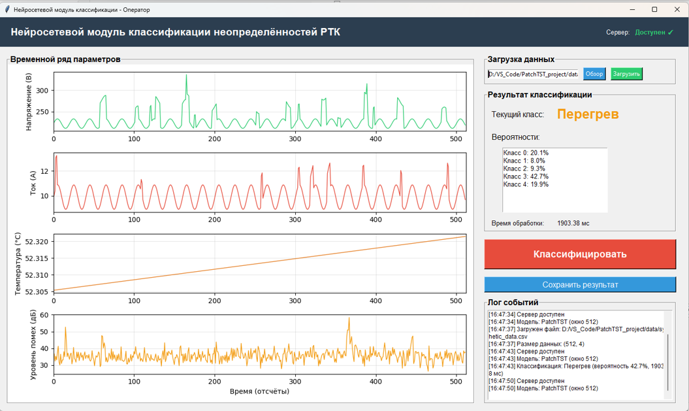
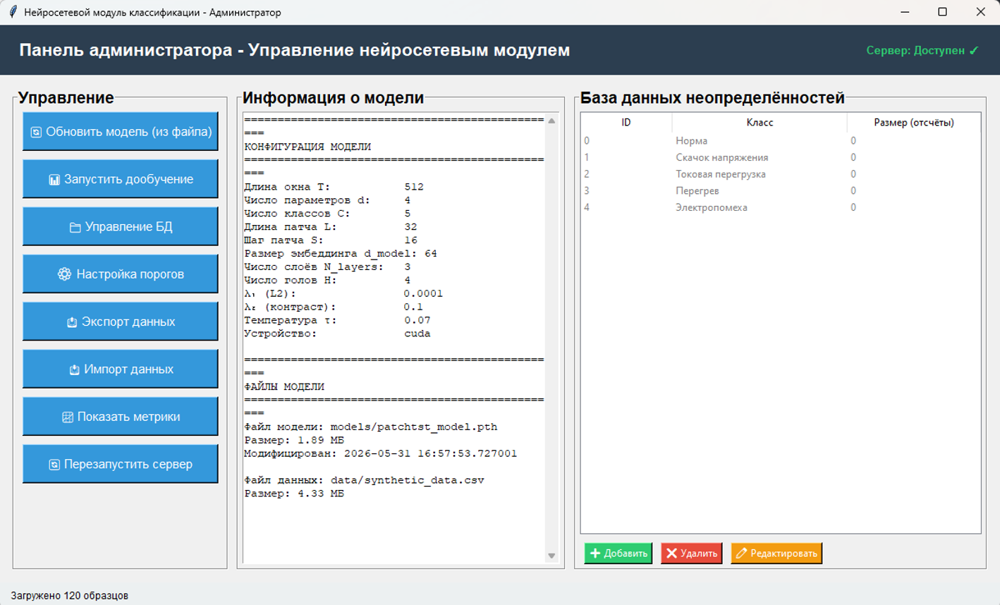
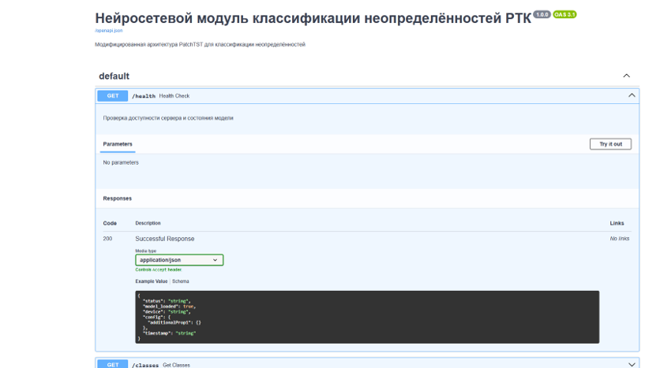

# Нейросетевой модуль классификации неопределённостей РТК

## Описание

Программная реализация модифицированной архитектуры PatchTST для классификации неопределённостей (напряжение, ток, температура, электромагнитные помехи) радиотехнического комплекса (РТК).

## Интерфейс программы

### Панель оператора



*Интерфейс панели оператора с результатом классификации*

### Панель администратора



*Управление базой данных и просмотр метрик*

### Документация API 



*Интерактивная документация FastAPI*


```bash

Структура проекта

config.py Конфигурация модели
model.py Модифицированный PatchTST
synthetic_data.py Генератор синтетических данных
data_loader.py Загрузка и предобработка
train.py Обучение модели
server.py FastAPI сервер
client.py GUI клиент оператора
admin.py GUI администратора

requirements.txt Зависимости
run_server.bat Запуск сервера (Windows)
run_client.bat Запуск клиента (Windows)
run_admin.bat Запуск администратора (Windows)
run_all.bat Запуск всех компонентов
run_train.bat Обучение модели

README.md Документация

1. Установка зависимостей

pip install -r requirements.txt

2. Генерация синтетических данных

python synthetic_data.py

3. Обучение модели

python train.py

4. Запуск сервера

python server.py

Сервер будет доступен на http://localhost:8000

Документация API: http://localhost:8000/docs

5. Запуск клиента (в другом окне терминала)

python client.py

6. Запуск панели администратора

python admin.py

---
Альтернативный запуск
Используйте bat-файлы для быстрого запуска:

run_server.bat — запуск сервера

run_client.bat — запуск клиента оператора

run_admin.bat — запуск панели администратора

run_all.bat — запуск всех компонентов

run_train.bat — обучение модели


7.Конфигурация. Основные параметры задаются в config.py:

WINDOW_LENGTH	-	Длина временного окна T (отсчётов)
NUM_CHANNELS -	Число параметров d
NUM_CLASSES	-	Число классов C
PATCH_LEN	-	Длина патча L
PATCH_STRIDE	-	Шаг патча S
D_MODEL	-	Размерность эмбеддинга d_model
NUM_HEADS	-	Число голов внимания H
NUM_LAYERS	-	Число слоёв трансформера L
DROPOUT	-	Вероятность dropout
MASK_PROB	-	Вероятность маскирования патчей
LAMBDA_1	-	Коэффициент L2-регуляризации λ₁
LAMBDA_2	-	Коэффициент контрастивной потери λ₂
TEMPERATURE	-	Температура для контрастивной потери τ


